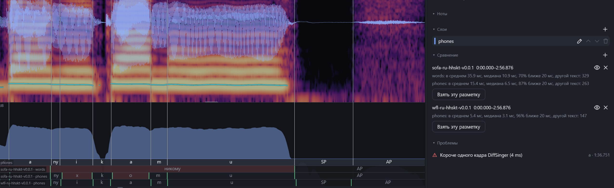

# WFL-ASR-hhskt-ru

**English** | [Русский](README.ru.md)

Russian phoneme labeling model for [WFL-ASR](https://github.com/MLo7Ghinsan/WFL-ASR/tree/refactor) (refactor branch).
It labels singing with phonemes **without lyrics**, or aligns a phoneme sequence you give it.
Output is HTK `.lab` in the hhskt phoneme set, the same one used by
[hhskt_ru_phonemizer](https://github.com/Megageorgio/hhskt_ru_phonemizer).



## Download

[Releases](https://github.com/Megageorgio/WFL-ASR-hhskt-ru/releases): `hhskt-ru-small.zip`, about 70 MB. Inside:

```
hhskt-ru-small.pt   weights (fp16)
config.yaml         model config
phonemes.txt        output labels
langs.txt           ru,0
```

## Usage

### mLabeler

Add the unpacked folder as a WFL-ASR model in [mLabeler](https://github.com/Megageorgio/mlabeler) and run autolabeling.

### WFL-ASR

Needs the `refactor` branch of WFL-ASR (tested on commit `8ea6559`) and its requirements
(`librosa==0.11.0`: newer librosa breaks Viterbi decoding).

```bash
git clone -b refactor https://github.com/MLo7Ghinsan/WFL-ASR
cd hhskt-ru-small
python ../WFL-ASR/infer.py -i path/to/wavs -ckpt hhskt-ru-small.pt -c config.yaml -l 0
```

Run it from the model folder: WFL-ASR looks for `phonemes.txt` in `save_dir` of `config.yaml` (`.`) and downloads
the `openai/whisper-base` encoder into `./encoder` on the first run.

- `.lab` files are written next to the `.wav` files **and overwrite existing ones**.
- Without lyrics the model recognizes phonemes itself.
- If there is a `.txt` with the same name next to the `.wav`, the model aligns that phoneme sequence instead
  (space-separated phonemes from the table below).

## Phonemes

| | |
|---|---|
| vowels | `a` `i` `u` `e` `o` `y`, `ax` (в**о**да), `x` (пр**и**вет), `ex` (**э**фир) |
| consonants | `b` `v` `g` `d` `z` `k` `l` `m` `n` `p` `r` `s` `t` `f` `h` `sh` `ts` `zh` |
| soft consonants | `by` `vy` `gy` `dy` `zy` `ky` `ly` `my` `ny` `py` `ry` `sy` `ty` `fy` `hy` `shy` (щ) `ch` `j` (й) |
| other | `SP` silence, `AP` breath, `vf` vocal fry, `cl` closure |

## Results

On recordings that were not used for training:

| | |
|---|---|
| phoneme error rate, without lyrics | 13.7% |
| boundary error, without lyrics | 13.0 ms on average, 89.0% within 20 ms |
| boundary error, with phoneme sequence | 10.6 ms on average, 89.4% within 20 ms, 97.5% within 50 ms |

## SOFA or WFL?

They solve different tasks, so it is worth trying both on your voice.

Example on one track (about 3 minutes, not used for training), compared to manual labels, phoneme tier:

| | mean boundary error | median | within 20 ms | phonemes that differ from the manual labels |
|---|---|---|---|---|
| WFL (without lyrics) | 5.4 ms | 3.1 ms | 96% | 147 |
| SOFA (with lyrics) | 15.4 ms | 6.5 ms | 87% | 263 |

This is one recording, not a benchmark: on another voice the result can be the other way round.

- **WFL** listens to what is actually sung. In the screenshot SOFA follows the dictionary
  (*никому* → `ny x k o m u`), WFL hears the sung `ny i k a m u` and also finds the `SP` before the breath.
  Boundaries are usually tighter. It does not need lyrics. It works best on voices close to the training data;
  on very different voices it confuses phonemes more often.
- **SOFA** needs lyrics and labels exactly the text it was given, with a words tier. It is the safer choice when
  the pronunciation must follow the text or the voice is unlike anything in the training data.

## Credits

- [WFL-ASR](https://github.com/MLo7Ghinsan/WFL-ASR) by MLo7Ghinsan.
